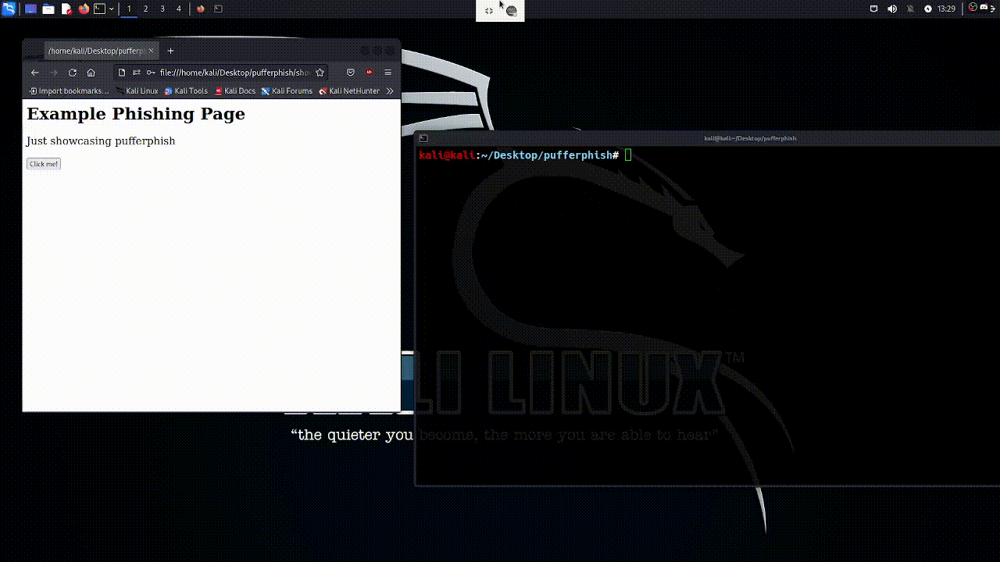

<h1 align="center">
    Pufferphish 🐡 A phishing toolkit
</h1>

<p align="center">
Pufferphish is a phising toolkit written in nodejs, it uses realtime websocket connection to communicate with the server. 
</p>


---

## 😋 Setup
### ...with Docker 
You can easily setup pufferphish with docker (assuming you already have docker installed):
```
git clone https://github.com/ngn13/pufferphish.git && cd pufferphish 
docker build -t pufferphish .
docker run -d -v $PWD/config.json:/app/config.json \
              -v $PWD/templates:/app/templates     \
              -v $PWD/logs:/app/logs               \
              -p 80:8080                           \
              pufferphish
```
Note that you will need restart the container after changing the configuration.

### ...without Docker
First install a recent version of `nodejs` and `npm`.
```bash
git clone https://github.com/ngn13/pufferphish.git && cd pufferphish
npm install
npm run start
```

### Nginx Reverse Proxy
You can use nginx reverse proxy for HTTPS. Here is configuration that you can 
copy and paste:
```conf
server {
  server_name   [domain];

  location / {
    proxy_pass http://localhost:[port];
    proxy_set_header X-Real-IP $remote_addr;
    proxy_http_version 1.1;
    proxy_set_header Upgrade $http_upgrade;
    proxy_set_header Connection 'upgrade';
    proxy_set_header Host $host;
    proxy_cache_bypass $http_upgrade;
  }
}
```

## ⚙️ Configuration</h2>
All the configuration is in the `config.json` file, here are the options:

- ### `port`
The port that the web server will listen on

- ### `template`
The template that will be served, currently there are **3** avaliable
templates:
- Discord
- Steam
- Microsoft

If you want, you can also create your own template, see the [example template](templates/empty.html)

- ### `path`
The path that the web server will serve the template

- ### `logfile`
If set to `true`, the websocket server will log all the connection to `logs.txt` file

- ### `blacklist`
List of blacklisted IPs, webserver will return with 404 to these

## ❤️  Support
If you want to support this project leave a star. Also consider contributing, am open for PRs and issues!
