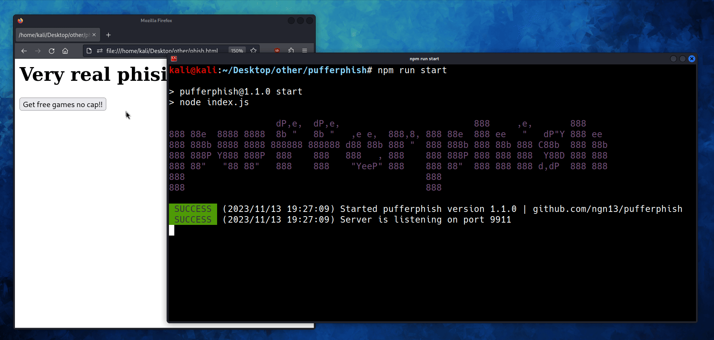

<h1 align="center">
    Pufferphish | A phishing toolkit
</h1>

<p align="center">
Pufferphish is a phising toolkit written in nodejs, it uses realtime websocket connection to communicate with the attacker server. 
</p>


## 😋 Setup
```
git clone https://github.com/ngn13/pufferphish.git
cd pufferphish
npm install
npm run start
```

## ⚙️ Configuring
All the configuration is in the `config.json` file, here
are the options:
#### `template`
The template that will be served, currently there are **3** avaliable
templates:
- Discord
- Steam
- Microsoft

If you want, you can also create your own template, see the [example template](templates/empty.html)
#### `port`
The port that the web server will listen on
#### `path`
The path that the web server will serve the template
#### `logfile`
If set to `true`, the websocket server will log all the connection to `logs.txt` file
#### `blacklist`
List of blacklisted IPs, webserver will return with 404 to these

## ❤️ Support
If you want to support this project leave a star.
Also consider contributing, I am open for PRs!
